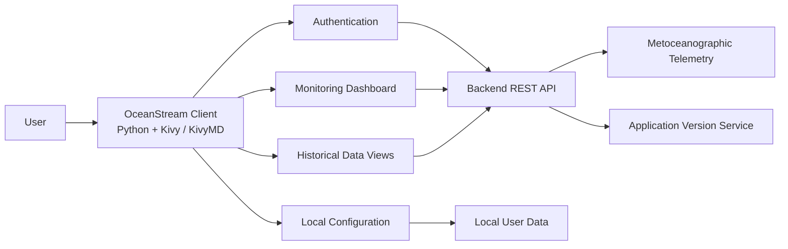

# OceanStream App

OceanStream is a cross-platform application for monitoring metoceanographic telemetry from field equipment such as current profilers, wave sensors, tide gauges, and meteorological stations.

The application is built in **Python** using **Kivy / KivyMD** and consumes authenticated backend APIs to display recent measurements and historical data across desktop and mobile environments.

> The repository is currently maintained as a technical portfolio project and client application for the OceanStream ecosystem.

## Overview

OceanStream provides a unified interface for accessing environmental monitoring data collected from multiple metoceanographic instruments.

The application supports:

- Authenticated API access
- Real-time/latest telemetry visualization
- Historical data queries
- Equipment-specific parameter views
- Configurable monitoring cards
- Cross-platform interfaces
- Local session persistence
- Mobile-oriented UI behavior for iOS and Android

The client communicates with a backend API that handles authentication, telemetry retrieval, and application version information.

## Main Capabilities

### Telemetry Monitoring

The application displays environmental and oceanographic measurements including:

- Current velocity and direction
- Wave height, period, and direction
- Tide level
- Wind speed, gusts, and direction
- Rainfall
- Equipment pitch and roll
- Battery voltage

### Equipment Support

The application includes support for multiple monitoring sources, including:

- ADCP buoys
- Wave gauges
- Tide gauges
- Meteorological stations

Each equipment type has its own telemetry mapping and data presentation logic.

### Historical Data

Users can query telemetry by date range and inspect measurements in structured tables.

The client:

- validates date ranges
- requests historical data from the backend
- dynamically builds equipment-specific tables
- formats timestamps and numeric values for display

### Configurable Monitoring Dashboard

Users can configure which equipment and parameters appear in the main overview.

Selections are persisted locally and reused when the application starts again.

### Authentication

OceanStream uses token-based authentication.

After login:

- the access token is stored in the application's writable user-data directory
- authenticated requests include the token through the `Authorization` header
- expired or invalid sessions redirect the user back to the login screen

The local JWT inspection is used only to check token expiration for user experience purposes.

Token authenticity is validated by the backend on authenticated requests.

## Tech Stack

### Application

- Python
- Kivy
- KivyMD
- Plyer

### API & Networking

- REST APIs
- Requests
- JWT-based authentication
- HTTPS

### Data

- JSON
- Backend telemetry APIs
- Local application configuration

### Platforms

- macOS / desktop
- iOS
- Android-oriented support

## Architecture

OceanStream follows a client/API architecture.



### Client Responsibilities

The OceanStream client handles:

- authentication workflow
- session persistence
- telemetry presentation
- equipment selection
- historical-data filtering
- parameter configuration
- cross-platform UI behavior
- application update checks

The backend remains responsible for authenticated access to telemetry and application data.

## Data Model & Telemetry Mapping

The client maps backend telemetry fields into human-readable environmental measurements.

Examples include:

```text
Current velocity        -> m/s
Current direction       -> degrees
Wave height             -> meters
Wave period             -> seconds
Tide level              -> meters
Wind speed              -> m/s
Wind gust               -> m/s
Rainfall                -> mm
Battery voltage         -> V
```

Different equipment types expose different combinations of these parameters.

## Engineering Highlights

### Cross-Platform UI

The application includes platform-specific behavior for desktop, Android, and iOS.

Examples include:

- responsive window behavior
- keyboard handling on iOS
- device-safe UI spacing
- platform-aware update flows
- writable application-data directories

### Asynchronous Data Loading

Telemetry loading is executed outside the main UI thread to avoid blocking the interface.

Results are scheduled back into the Kivy main thread for rendering.

### Dynamic Equipment Views

OceanStream dynamically builds telemetry views according to:

- selected equipment
- selected parameters
- equipment type
- returned API data

This allows a common application interface to support multiple sensor classes.

### Session Handling

The application persists the authentication token locally and automatically handles:

- missing tokens
- expired sessions
- HTTP 401 responses
- logout flows

### Application Updates

The client can query the backend for the latest available application version and prompt users when an update is available.

## Configuration

The backend API URL can be configured through the environment variable:

```bash
OCEANSTREAM_API_URL
```

Example:

```env
OCEANSTREAM_API_URL=https://your-api.example.com/
```

A public `.env.example` can be used as a configuration reference.

Sensitive values should never be committed to the repository.

## Running Locally

### 1. Clone the repository

```bash
git clone https://github.com/miguelvneto/OceanStream-app.git
cd OceanStream-app
```

### 2. Create a virtual environment

```bash
python3 -m venv .venv
```

Activate it:

#### macOS / Linux

```bash
source .venv/bin/activate
```

#### Windows

```bash
.venv\Scripts\activate
```

### 3. Install dependencies

```bash
pip install -r requirements.txt
```

### 4. Configure the API

Create your local environment configuration using the public example:

```bash
cp .env.example .env
```

Then configure:

```env
OCEANSTREAM_API_URL=https://your-api.example.com/
```

### 5. Run the application

```bash
python main.py
```

## Repository Security

The repository is configured to avoid committing local application and authentication files.

Examples of ignored content include:

```gitignore
.DS_Store
**/.DS_Store
oceanstream.jwt
.env
.env.*
!.env.example
*.keystore
*.jks
.wsl/
```

Authentication tokens are stored in the operating system's application user-data directory rather than directly inside the source tree.

## Project Structure

A simplified view of the application:

```text
OceanStream-app/
├── main.py
├── navigation_bar.py
├── requirements.txt
├── paginas/
│   ├── login.kv
│   ├── overview.kv
│   ├── equipamento.kv
│   ├── configuracao.kv
│   ├── alertas.kv
│   └── splash.kv
├── data/
│   └── cards.json
├── res/
│   └── application assets
└── .env.example
```

## Current Development

The project continues to evolve around:

- cross-platform application support
- telemetry presentation
- API integration
- user experience improvements
- monitoring workflows
- equipment-specific visualization

## About the Developer

Built by **Miguel Vieira Neto**.

Senior Software Engineer & Technical Lead with experience in backend systems, telemetry, PostgreSQL, cloud infrastructure, production systems, APIs, and technical leadership.

- GitHub: https://github.com/miguelvneto
- LinkedIn: https://www.linkedin.com/in/miguel-neto1
